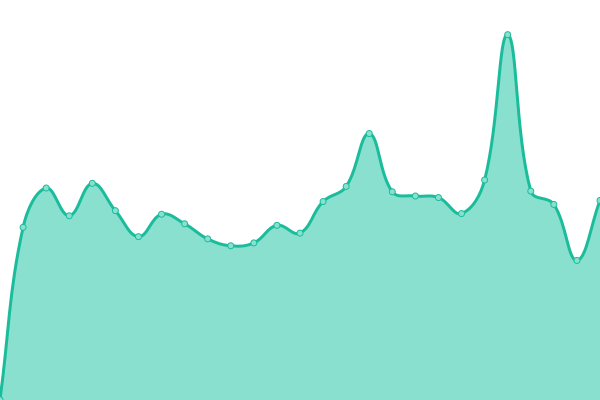

# [📈 Live Status](https://upptime.madebug.net): <!--live status--> **🟧 Partial outage**

This repository contains the open-source uptime monitor and status page for [m4d3bug](https://blog.madebug.net), powered by [Upptime](https://github.com/upptime/upptime).

With [Upptime](https://upptime.js.org), you can get your own unlimited and free uptime monitor and status page, powered entirely by a GitHub repository. We use [Issues](https://github.com/m4d3bug/upptime/issues) as incident reports, [Actions](https://github.com/m4d3bug/upptime/actions) as uptime monitors, and [Pages](https://upptime.madebug.net) for the status page.

<!--start: status pages-->
<!-- This summary is generated by Upptime (https://github.com/upptime/upptime) -->
<!-- Do not edit this manually, your changes will be overwritten -->
<!-- prettier-ignore -->
| URL | Status | History | Response Time | Uptime |
| --- | ------ | ------- | ------------- | ------ |
|  [Blog](https://blog.madebug.net) | 🟩 Up | [blog.yml](https://github.com/m4d3bug/upptime/commits/HEAD/history/blog.yml) | 

 162ms
     
 | 

<a href="https://upptime.madebug.net/history/blog">100.00%</a>
    

|  [LB-00](https://lb-00.m4d3bug.com) | 🟩 Up | [lb-00.yml](https://github.com/m4d3bug/upptime/commits/HEAD/history/lb-00.yml) | 

 746ms
     
 | 

<a href="https://upptime.madebug.net/history/lb-00">28.57%</a>
    

|  [LB-01](https://lb-01.m4d3bug.com) | 🟩 Up | [lb-01.yml](https://github.com/m4d3bug/upptime/commits/HEAD/history/lb-01.yml) | 

 672ms
     
 | 

<a href="https://upptime.madebug.net/history/lb-01">100.00%</a>
    

|  [LB-02](https://lb-02.m4d3bug.com) | 🟩 Up | [lb-02.yml](https://github.com/m4d3bug/upptime/commits/HEAD/history/lb-02.yml) | 

 549ms
     
 | 

<a href="https://upptime.madebug.net/history/lb-02">100.00%</a>
    

|  [LB-03](https://lb-03.m4d3bug.com) | 🟩 Up | [lb-03.yml](https://github.com/m4d3bug/upptime/commits/HEAD/history/lb-03.yml) | 

 671ms
     
 | 

<a href="https://upptime.madebug.net/history/lb-03">100.00%</a>
    

|  [LB-04](https://lb-04.m4d3bug.com) | 🟥 Down | [lb-04.yml](https://github.com/m4d3bug/upptime/commits/HEAD/history/lb-04.yml) | 

 0ms
     
 | 

<a href="https://upptime.madebug.net/history/lb-04">0.00%</a>
    

|  [Whoogle](https://whoogle.madebug.net) | 🟩 Up | [whoogle.yml](https://github.com/m4d3bug/upptime/commits/HEAD/history/whoogle.yml) | 

 1118ms
     
 | 

<a href="https://upptime.madebug.net/history/whoogle">100.00%</a>
    

|  [AI](https://ai.madebug.net) | 🟩 Up | [ai.yml](https://github.com/m4d3bug/upptime/commits/HEAD/history/ai.yml) | 

 864ms
     
 | 

<a href="https://upptime.madebug.net/history/ai">100.00%</a>
    

|  [CFyes](cfyes.m4d3bug.com) | 🟩 Up | [c-fyes.yml](https://github.com/m4d3bug/upptime/commits/HEAD/history/c-fyes.yml) | 

 112ms
     
 | 

<a href="https://upptime.madebug.net/history/c-fyes">100.00%</a>
    

|  [Google DNS](8.8.4.4) | 🟩 Up | [google-dns.yml](https://github.com/m4d3bug/upptime/commits/HEAD/history/google-dns.yml) | 

 4ms
     
 | 

<a href="https://upptime.madebug.net/history/google-dns">100.00%</a>
    

<!--end: status pages-->

[**Visit our status website →**](https://upptime.madebug.net)

## 📄 License

- Powered by: [Upptime](https://github.com/upptime/upptime)
- Code: [MIT](./LICENSE) © [m4d3bug](https://blog.madebug.net)
- Data in the `./history` directory: [Open Database License](https://opendatacommons.org/licenses/odbl/1-0/)
